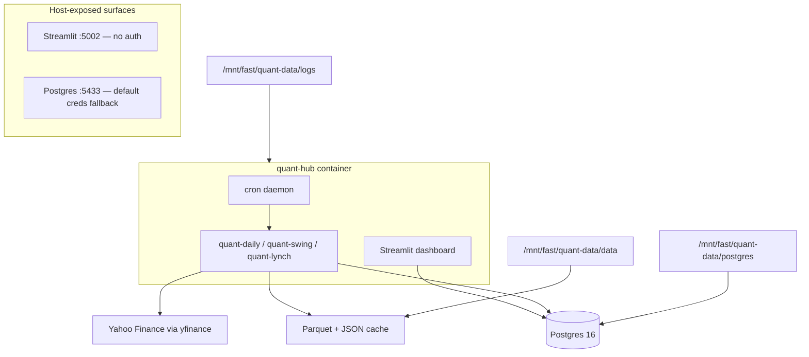

# Quant Hub — Architecture Gaps & Remediation

**Version:** 1.0  
**Audience:** Platform owners, enterprise architects, operators  
**Last updated:** 2026-06-28  
**Status:** Living document — track open gaps until remediated

Related: [Runbook](RUNBOOK.md) · [Data Model / ERD](DATA_MODEL.md) · [User Manual](USER_MANUAL.md)

---

## Purpose

This document records **known gaps and unaddressed issues** identified in an enterprise architecture review of Quant Hub. It complements the runbook (how to operate) and data model (what exists) by stating **what is missing or incomplete** for production-grade homelab or enterprise use.

Quant Hub is intentionally scoped as a **homelab v1** system. Many items below are acceptable if the deployment stays LAN-only, single-operator, and behind trusted network controls. They become critical if the dashboard or database is exposed beyond the homelab.

---

## Table of contents

1. [Architecture snapshot](#1-architecture-snapshot)
2. [What is already implemented](#2-what-is-already-implemented)
3. [Findings by severity](#3-findings-by-severity)
4. [Homelab-acceptable scope](#4-homelab-acceptable-scope)
5. [Remediation phases](#5-remediation-phases)
6. [Top 10 priorities](#6-top-10-priorities)
7. [Tracking](#7-tracking)

---

## 1. Architecture snapshot

**Single-container design:** cron, dashboard, and all scan CLIs run in one `quant-hub` container. A long scan, crash, or resource spike affects scheduling and the dashboard together.

---

## 2. What is already implemented

Do **not** re-implement these — they are in place:

| Area | Implementation |
|------|----------------|
| Parameterized SQL | `%s` placeholders in `src/quant_hub/infrastructure/postgres/repository.py` |
| Same-day scan idempotency | `ON CONFLICT (scan_date, strategy_id, universe_id) DO UPDATE` upsert |
| Postgres healthcheck | `docker-compose.yml` postgres service |
| Job audit table | `job_runs` + `JobRunRepository` |
| Price / fundamentals caching | Parquet + JSON with TTL |
| Lynch fetch retries | `src/quant_hub/lynch/metrics.py` |
| Ticker validation (CLI / files) | `src/quant_hub/data/tickers.py` |
| Fixture exclusion in dashboard | `src/quant_hub/infrastructure/postgres/fixtures.py` |
| Data provenance in reports | `src/quant_hub/data/provenance.py` |
| Operator runbook | `docs/RUNBOOK.md` |
| Layered architecture | `application` / `engine` / `infrastructure` separation |
| Scanner pipeline docs | `docs/BREAKOUT_SCANNER.md`, `SWING_SCANNER.md`, `LYNCH_SCANNER.md` |
| Data dictionary | `docs/DATA_MODEL.md` |

---

## 3. Findings by severity

### Critical

#### C1 — Unauthenticated dashboard bound to all interfaces

| | |
|---|---|
| **Issue** | Streamlit listens on `0.0.0.0:5000` (host `:5002`) with no authentication. Anyone who can reach the port gets full scan data and the admin “System status” panel (table counts, job history). |
| **Evidence** | `docker/entrypoint.sh` — `quant-view --server.address 0.0.0.0`; `docker-compose.yml` — `ports: "5002:5000"`; `src/quant_hub/dashboard/app.py` — `_render_system_panel()`; `docs/RUNBOOK.md` §11 acknowledges no built-in auth |
| **Remediation** | Place behind reverse proxy with auth (OAuth, basic auth, or VPN-only). Do not expose `:5002` beyond trusted LAN. |

#### C2 — PostgreSQL exposed with weak default credentials

| | |
|---|---|
| **Issue** | Postgres published on host `:5433` with password defaulting to `quant` if `POSTGRES_PASSWORD` is unset. Application default DSN also hardcodes `quant:quant`. |
| **Evidence** | `docker-compose.yml` — `POSTGRES_PASSWORD: ${POSTGRES_PASSWORD:-quant}`; `src/quant_hub/config.py` — `database_url()` default; `.env.example` |
| **Remediation** | Require strong passwords (remove compose fallback), bind Postgres to internal Docker network only (remove host port or firewall), rotate credentials. |

---

### High

#### H1 — No CI/CD pipeline

| | |
|---|---|
| **Issue** | No GitHub Actions, GitLab CI, or similar. Tests and lint are manual only. |
| **Evidence** | No `.github/` or CI config; manual steps in `docs/RUNBOOK.md` §8 |
| **Remediation** | Add CI: `ruff check`, `pytest tests/unit`, optional Docker build; Postgres service container for DB-dependent tests. |

#### H2 — Backups documented but not automated

| | |
|---|---|
| **Issue** | Backup/restore is manual `pg_dump` in runbook. Cutover checklist item “Backups configured” is unchecked. No cron, retention, or restore drill. |
| **Evidence** | `docs/RUNBOOK.md` §6, §12; `docs/DATA_MODEL.md` §11 |
| **Remediation** | Scheduled `pg_dump`, off-host copy, retention (e.g. 30 daily / 12 monthly), periodic restore test. |

#### H3 — Silent operational failures

| | |
|---|---|
| **Issue** | Cron redirects to log file only — no alerting on non-zero exit. Schema init failures swallowed on startup. App container has no healthcheck. Email failure does not update `job_runs.status`. |
| **Evidence** | `docker/crontab` — `>> /app/logs/cron.log 2>&1`; `docker/entrypoint.sh` — `quant-hub init-db ... \|\| true`; `docker-compose.yml` — healthcheck only on postgres; `src/quant_hub/application/*_service.py` — `finish_job(status="success")` even when email fails |
| **Remediation** | Fail fast on `init-db`; add quant-hub healthcheck; alert on cron failure / stale scans; align `job_runs.status` with CLI exit code. |

#### H4 — No versioned schema migration system

| | |
|---|---|
| **Issue** | Schema is a single idempotent `CREATE TABLE IF NOT EXISTS` applied on startup. Cannot safely alter columns, add indexes, or evolve JSONB metadata in production. |
| **Evidence** | `src/quant_hub/infrastructure/postgres/schema.sql`; `connection.py` — `apply_schema()`; `repository.py` — `METADATA_SCHEMA_VERSION = 1` in code only |
| **Remediation** | Alembic or numbered SQL migrations; `schema_version` table; separate bootstrap from upgrade. |

#### H5 — Job audit trail reports misleading outcomes

| | |
|---|---|
| **Issue** | Breakout `tickers_failed` is almost always 0 (`len(universe) - len(scan_result.universe)` where sizes match). Cron swing jobs log as `swing-weekly-manual` instead of names in `docker/jobs.yaml`. Lynch marks `success` when many Yahoo fetches fail. |
| **Evidence** | `src/quant_hub/application/scan_service.py` lines 150–158; `src/quant_hub/cli/swing.py` — `job_name="swing-weekly-manual"` in `main()`; `src/quant_hub/application/lynch_service.py` lines 100–108 |
| **Remediation** | Count failures from per-ticker outcomes; add `partial` / `degraded` status; unify cron CLI job names with `docker/jobs.yaml`. |

#### H6 — Container runs as root; secrets in cron environment

| | |
|---|---|
| **Issue** | Dockerfile sets `USER root`. Entrypoint dumps env (including `SMTP_PASSWORD`, `DATABASE_URL`) into `/etc/environment` for cron. |
| **Evidence** | `docker/Dockerfile`; `docker/entrypoint.sh` — `printenv \| grep ... > /etc/environment` |
| **Remediation** | Non-root user; Docker secrets or restricted env files (`0600`); minimal vars for cron wrapper. |

#### H7 — No metrics, tracing, or alerting integration

| | |
|---|---|
| **Issue** | Plain-text logs to files only. No Prometheus, OpenTelemetry, Sentry, or health endpoints beyond CLI `quant-hub status` and dashboard DB ping. |
| **Evidence** | `src/quant_hub/logging_setup.py`; no observability deps in `pyproject.toml`; `docs/RUNBOOK.md` §5 |
| **Remediation** | Structured JSON logs; emit scan duration, cache hit rate, fetch failure counts; external alerting on failed jobs / stale scans. |

---

### Medium

#### M1 — Reflected XSS risk in dashboard ticker HTML

| | |
|---|---|
| **Issue** | `?ticker=` query params are uppercased but not validated or HTML-escaped before `unsafe_allow_html` rendering. |
| **Evidence** | `src/quant_hub/dashboard/viz/navigation.py` — `sync_detail_ticker()`, `ticker_link_html()` |
| **Remediation** | Validate tickers against `^[A-Z][A-Z0-9.\-]{0,9}$`; HTML-escape dynamic content; ignore unknown tickers. |

#### M2 — Unbounded Postgres growth; destructive ops without safeguards

| | |
|---|---|
| **Issue** | No automated retention for `scan_runs` / `ticker_results` JSONB. `scripts/full-rescan.sh` TRUNCATEs all history non-interactively. |
| **Evidence** | `docs/DATA_MODEL.md` §11; `scripts/full-rescan.sh` |
| **Remediation** | Retention job (e.g. 90 days); archive before purge; `--confirm` flag on full-rescan. |

#### M3 — Cache–database consistency is best-effort

| | |
|---|---|
| **Issue** | Parquet and fundamentals cache can refresh independently of Postgres. Dashboard reads Postgres only — stale persisted results possible. |
| **Evidence** | `src/quant_hub/infrastructure/cache/parquet_cache.py`; `src/quant_hub/dashboard/app.py` |
| **Remediation** | Surface cache age / `as_of_price` staleness in UI; re-persist or warn when cache refreshes beyond threshold. |

#### M4 — Integration / E2E test gaps

| | |
|---|---|
| **Issue** | ~17 unit test files; no integration tests in CI. Repository tests skip without Postgres. No tests for email, swing/lynch services end-to-end, or cron/Docker. |
| **Evidence** | `pyproject.toml` — `addopts = "-m 'not integration'"`; `tests/unit/test_repository.py`, `test_scan_service.py` |
| **Remediation** | CI Postgres service; integration tests with mocked yfinance; contract tests for upsert/load. |

#### M5 — Email layer lacks escaping and retry

| | |
|---|---|
| **Issue** | SMTP has no retry/backoff. HTML emails embed Yahoo-derived fields without escaping. |
| **Evidence** | `src/quant_hub/notify/email.py` |
| **Remediation** | HTML-escape dynamic fields; SMTP retry; distinguish “scan ok, email failed” in job status. |

#### M6 — Scheduled job naming / documentation drift

| | |
|---|---|
| **Issue** | `docker/jobs.yaml` documents job names; `docker/crontab` is authoritative but not generated from it. Swing cron uses `swing-weekly-manual` job name. |
| **Evidence** | `docker/jobs.yaml`; `docker/crontab`; `src/quant_hub/cli/swing.py` |
| **Remediation** | Generate crontab from `jobs.yaml` or validate in CI; consistent `job_name` in cron entrypoints. |

#### M7 — Single-process scanning; overlapping cron without locking

| | |
|---|---|
| **Issue** | Breakout engine iterates tickers sequentially. Friday jobs overlap (ETF breakout 4:30, swing 4:35, sp500 breakout 5:17, swing 6:17) with no coordination. |
| **Evidence** | `src/quant_hub/engine/runner.py`; `docker/crontab` |
| **Remediation** | DB advisory lock or file mutex; stagger jobs; queue-based workers for large universes. |

#### M8 — Supply chain and dependency pinning gaps

| | |
|---|---|
| **Issue** | Open lower bounds in `pyproject.toml`. Dockerfile installs `uv` via `curl \| sh` without checksum. |
| **Evidence** | `pyproject.toml`; `docker/Dockerfile` |
| **Remediation** | Lock file (`uv.lock`); pin base image digest; verify install script checksums. |

#### M9 — PII in example config

| | |
|---|---|
| **Issue** | `.env.example` contains real-looking email addresses. |
| **Evidence** | `.env.example` — `EMAIL_TO=...` |
| **Remediation** | Use placeholder addresses in examples. |

---

### Low

| ID | Issue | Evidence | Remediation |
|----|-------|----------|-------------|
| L1 | Missing DB indexes for operational queries | `schema.sql` — no index on `job_runs(status)` | Add `(status, started_at DESC)`, `(job_name, started_at DESC)` |
| L2 | No connection pooling or statement timeouts | `connection.py` — new connection per call | psycopg pool, `connect_timeout`, retry on transient errors |
| L3 | Breakout fundamentals fetch lacks retry | `data/fundamentals/provider.py` vs Lynch retries | Reuse Lynch-style retry/backoff |
| L4 | Misleading module name `duckdb_store` | `history/duckdb_store.py` reads Postgres only | Rename to `lynch_history.py` |
| L5 | Compliance / audit gaps | No log of manual CLI, dashboard access, exports | Optional `audit_events` table |
| L6 | Log rotation not built in | `logging_setup.py`; manual truncate in runbook | Ship logrotate config or size-based rotation |
| L7 | Docker compose lacks resource limits | `docker-compose.yml` | `mem_limit`, `cpus`, `cap_drop`, read-only root FS where feasible |
| L8 | No dev/staging/prod separation | Single `.env`, single compose stack | Document environments; separate compose overrides |
| L9 | JSONB `detail` schema contract unvalidated on read | Strategy-specific shapes in code only | Optional JSON schema validation on load |

---

## 4. Homelab-acceptable scope

The following are **gaps by enterprise standards** but may remain out of scope for homelab v1 if documented assumptions hold:

- No multi-tenancy / RBAC
- No HA Postgres or read replicas
- No message queue / worker pool
- Documentation hosted on GitHub only (not in dashboard)
- Sequential per-ticker scanning
- Single external data vendor (Yahoo Finance)

**Assumption:** Dashboard and Postgres are reachable only on a trusted LAN; one primary operator; no regulatory audit requirements.

---

## 5. Remediation phases

### Phase 1 — Security (immediate)

| Item | Findings |
|------|----------|
| Lock down network exposure | C1, C2 |
| Remove default password fallbacks | C2 |
| Dashboard ticker validation / XSS | M1 |
| Sanitize `.env.example` | M9 |

**Exit criteria:** Dashboard and Postgres not reachable from untrusted networks; strong secrets required; no default creds in compose.

### Phase 2 — Operations (short term)

| Item | Findings |
|------|----------|
| Automated backups + restore drill | H2 |
| Cron failure alerting + app healthcheck | H3 |
| Fix job telemetry and exit-code alignment | H5 |
| Generate or validate crontab vs jobs.yaml | M6 |
| Confirmation on destructive scripts | M2 |

**Exit criteria:** Failed jobs alert within 24h; weekly backup verified; `job_runs` trustworthy for ops queries.

### Phase 3 — Engineering quality (medium term)

| Item | Findings |
|------|----------|
| CI/CD with Postgres tests | H1, M4 |
| Schema migrations | H4 |
| Container hardening | H6 |
| Structured logging + stale-scan metrics | H7 |
| Dependency lock file | M8 |

**Exit criteria:** Every PR runs tests; schema changes use migrations; logs queryable; dependency versions pinned.

### Phase 4 — Scale and resilience (optional)

| Item | Findings |
|------|----------|
| Job locking for overlapping cron | M7 |
| Retention / archival policy | M2 |
| Split scheduler vs worker vs dashboard | Architecture |
| Secondary data source / circuit breaker | External dependency |
| Connection pooling | L2 |

---

## 6. Top 10 priorities

| # | Priority | Rationale |
|---|----------|-----------|
| 1 | Lock down dashboard + Postgres network exposure | Highest risk if LAN breached or ports forwarded |
| 2 | Change default secrets; remove compose password fallback | Trivial compromise if `.env` not customized |
| 3 | Add CI/CD with Postgres-backed tests | No automated quality gate today |
| 4 | Automate backups with retention and restore verification | All history on single host volume |
| 5 | Cron/job failure alerting + app container healthcheck | Silent failures possible (`init-db \|\| true`, log-only cron) |
| 6 | Introduce schema migrations | Cannot safely evolve DB beyond `IF NOT EXISTS` |
| 7 | Fix `job_runs` telemetry and align with exit codes | Broken `tickers_failed`, success despite email/partial fetch failures |
| 8 | Harden container (non-root, secret handling) | Root + `/etc/environment` secret dump |
| 9 | Fix dashboard XSS in ticker HTML + validate query params | Exploitable if dashboard is reachable |
| 10 | Add observability (structured logs, metrics, stale-scan alerts) | Operators must manually tail logs and run CLI checks |

---

## 7. Tracking

Use this table to mark progress. Update **Status** and **Target phase** as work completes.

| ID | Status | Target phase | Owner | Notes |
|----|--------|--------------|-------|-------|
| C1 | Open | 1 | | |
| C2 | Open | 1 | | |
| H1 | Open | 3 | | |
| H2 | Open | 2 | | Runbook §6 manual only |
| H3 | Open | 2 | | |
| H4 | Open | 3 | | |
| H5 | Open | 2 | | |
| H6 | Open | 3 | | |
| H7 | Open | 3 | | |
| M1 | Open | 1 | | |
| M2 | Open | 2 | | |
| M3 | Open | 4 | | |
| M4 | Open | 3 | | |
| M5 | Open | 2 | | |
| M6 | Open | 2 | | |
| M7 | Open | 4 | | |
| M8 | Open | 3 | | |
| M9 | Open | 1 | | |
| L1–L9 | Open | 4 | | See §3 Low table |

**Review cadence:** Revisit this document after major releases or before exposing the system beyond the homelab LAN.

---

## Related source files

| Topic | Path |
|-------|------|
| Compose / ports | `docker-compose.yml` |
| Container entrypoint | `docker/entrypoint.sh` |
| Cron schedule | `docker/crontab`, `docker/jobs.yaml` |
| Postgres schema | `src/quant_hub/infrastructure/postgres/schema.sql` |
| Job repository | `src/quant_hub/infrastructure/postgres/repository.py` |
| Scan services | `src/quant_hub/application/scan_service.py`, `swing_service.py`, `lynch_service.py` |
| Dashboard | `src/quant_hub/dashboard/app.py` |
| Email | `src/quant_hub/notify/email.py` |
| Full rescan script | `scripts/full-rescan.sh` |
